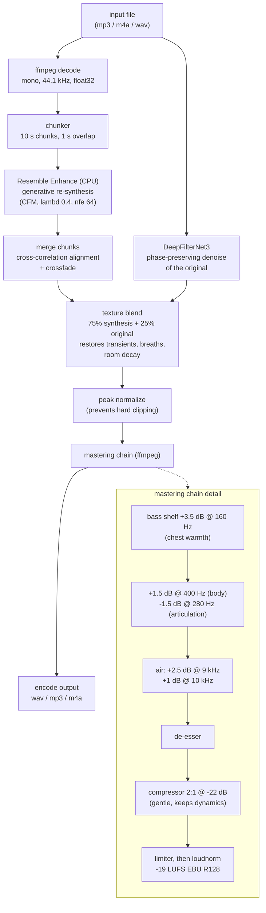

# CrispVoice - Technical Stack and Processing Flow

A fully local, privacy-first alternative to cleanvoice.ai: takes any voice
recording (mp3/m4a/wav) and outputs studio-quality podcast audio. No audio
ever leaves the machine.

## The two problems being solved

"Studio quality" is not one operation but two:

1. **Subtractive cleanup** - remove what should not be there: background
   noise, hum, room reverb. Classic denoising.
2. **Generative restoration** - add back what a cheap microphone never
   captured: full frequency bandwidth, body, clarity. The information is not
   in the recording, so a neural network re-synthesizes the voice conditioned
   on the input. This is the "high-end mic" effect commercial tools sell.

Both are followed by a broadcast-style mastering chain for the final polish.

## Technical stack

| Layer | Choice | Why |
|---|---|---|
| Package/env manager | uv (project-local) | Everything, including the Python 3.11 interpreter, lives inside this folder (`.runtime/`, `.venv/`); one `uninstall.sh` removes it all |
| ML runtime | PyTorch 2.2.2, CPU only | numpy pinned <2 for compatibility. GPU (Apple MPS) is deliberately banned: it shares unified memory with macOS and can freeze a 16 GB machine even with memory caps |
| Enhancement model | Resemble Enhance (MIT) | Two-stage: UNet denoiser + latent conditional flow matching (diffusion-style) enhancer, outputs re-synthesized 44.1 kHz speech. Weights (~713 MB) in `models/enhancer_stage2/` |
| Dependency patch | Stub `deepspeed` package in site-packages | Real deepspeed is training-only and does not build on macOS; the stub satisfies imports, inference never calls it |
| Audio I/O + DSP | ffmpeg 7.1 (bundled inside the venv via imageio-ffmpeg) | Decode any input format, apply the mastering filter chain, encode output. soundfile handles wav read/write at the Python boundary |
| Entry point | `./enhance` -> `enhance.py` | Shell wrapper runs Python under `nice -n 15` |

## Processing flow



## How the pipeline was tuned

Roughly fifty variants were blind A/B tested against a CleanVoice output of
the same recording, judged by a human listener and by AI review (Gemini
audio analysis for verbal diagnosis; DNSMOS/SQUIM MOS predictors as sanity
checks). The final version scores within a few percent of the commercial
reference. Hard-won lessons:

1. **Peak clipping was the biggest bug.** The model emits peaks above digital
   full scale; encoding without normalization hard-clips them into audible
   crackle. Spectral averages never show this - waveform peaks do.
2. **Static spectral matching fails.** A 28-band FIR match EQ fitted to the
   reference measured within +-1 dB yet sounded phasey and smeared (FIR
   ringing). Gentle low-order filters beat surgical curves.
3. **Re-synthesis alone sounds synthetic.** The winning move was blending
   25% of a phase-preserving denoise of the original back in - it restores
   micro-transients, breath envelopes, and room decay that generative models
   round off.
4. **Aggressive denoising sounds watery.** lambd 0.4 beat 0.9; noise gates
   and multiband compressors introduced more artifacts than they removed.

## Resource safety (hard requirement)

The machine must stay usable while processing:

- CPU only; the GPU path was removed from the code after MPS memory pressure
  froze the development machine. Do not add it back.
- Model uses half the CPU cores (`--threads` to lower further), at low
  process priority (`nice 15`).
- 10-second chunks bound peak memory (~6.6 GB RSS, ordinary swappable
  memory).
- Per-chunk progress lines: percent, elapsed, ETA, RSS.
- Throughput is roughly 1.4x real time (an 8.5 min file takes ~12 min).

## Repo layout

```
enhance            launcher (nice + project venv)
enhance.py         pipeline: decode -> chunked inference -> master -> encode
uninstall.sh       deletes the entire project + prunes uv wheel cache
.runtime/          Python 3.11 interpreter (uv-managed, project-local)
.venv/             torch, resemble-enhance, bundled ffmpeg, deepspeed stub
models/            Resemble Enhance checkpoint + hparams
samples/           test clips and A/B tuning variants
```
