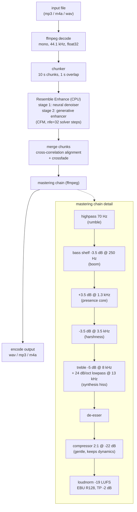

# CrispVoice - Technical Stack and Processing Flow

A fully local, privacy-first alternative to cleanvoice.ai: takes any voice
recording (mp3/m4a/wav) and outputs studio-quality podcast audio. No audio
ever leaves the machine.

## The two problems being solved

"Studio quality" is not one operation but two:

1. **Subtractive cleanup** - remove what should not be there: background
   noise, hum, room reverb. Classic denoising.
2. **Generative restoration** - add back what a cheap microphone never
   captured: full frequency bandwidth, body, clarity. The information is not
   in the recording, so a neural network re-synthesizes the voice conditioned
   on the input. This is the "high-end mic" effect commercial tools sell.

Both are followed by a broadcast-style mastering chain for the final polish.

## Technical stack

| Layer | Choice | Why |
|---|---|---|
| Package/env manager | uv (project-local) | Everything, including the Python 3.11 interpreter, lives inside this folder (`.runtime/`, `.venv/`); one `uninstall.sh` removes it all |
| ML runtime | PyTorch 2.2.2, CPU only | numpy pinned <2 for compatibility. GPU (Apple MPS) is deliberately banned: it shares unified memory with macOS and can freeze a 16 GB machine even with memory caps |
| Enhancement model | Resemble Enhance (MIT) | Two-stage: UNet denoiser + latent conditional flow matching (diffusion-style) enhancer, outputs re-synthesized 44.1 kHz speech. Weights (~713 MB) in `models/enhancer_stage2/` |
| Dependency patch | Stub `deepspeed` package in site-packages | Real deepspeed is training-only and does not build on macOS; the stub satisfies imports, inference never calls it |
| Audio I/O + DSP | ffmpeg 7.1 (bundled inside the venv via imageio-ffmpeg) | Decode any input format, apply the mastering filter chain, encode output. soundfile handles wav read/write at the Python boundary |
| Entry point | `./enhance` -> `enhance.py` | Shell wrapper runs Python under `nice -n 15` |

## Processing flow



## How the mastering chain was tuned

The chain was not guessed; it was fitted against a CleanVoice output of the
same recording:

1. Computed long-term average spectra (Welch PSD, 9 octave-ish bands) of our
   un-mastered model output vs the CleanVoice reference, level-normalized on
   the 300-5000 Hz speech core.
2. The measured gaps became filters: +16 dB excess above 12 kHz (model
   synthesis hiss) -> steep lowpass; +3.5 dB low-end excess -> bass shelf;
   recessed 600-2500 Hz -> presence boost; +4 dB @ 2.5-5 kHz -> peaking cut.
3. Dynamics: our old chain measured LRA 1.9 LU vs their 3.9 (over-compressed)
   and -16 vs their -19 LUFS (too loud). Compression softened to 2:1,
   loudness target moved to -19 LUFS.
4. Iterated twice; final output sits within about +-1 dB of the reference in
   every band except 1-2.5 kHz.

## Resource safety (hard requirement)

The machine must stay usable while processing:

- CPU only; the GPU path was removed from the code after MPS memory pressure
  froze the development machine. Do not add it back.
- Model uses half the CPU cores (`--threads` to lower further), at low
  process priority (`nice 15`).
- 10-second chunks bound peak memory (~6.6 GB RSS, ordinary swappable
  memory).
- Per-chunk progress lines: percent, elapsed, ETA, RSS.
- Throughput is roughly 1.4x real time (an 8.5 min file takes ~12 min).

## Repo layout

```
enhance            launcher (nice + project venv)
enhance.py         pipeline: decode -> chunked inference -> master -> encode
uninstall.sh       deletes the entire project + prunes uv wheel cache
.runtime/          Python 3.11 interpreter (uv-managed, project-local)
.venv/             torch, resemble-enhance, bundled ffmpeg, deepspeed stub
models/            Resemble Enhance checkpoint + hparams
samples/           test clips and A/B tuning variants
```
